# Yahtzee

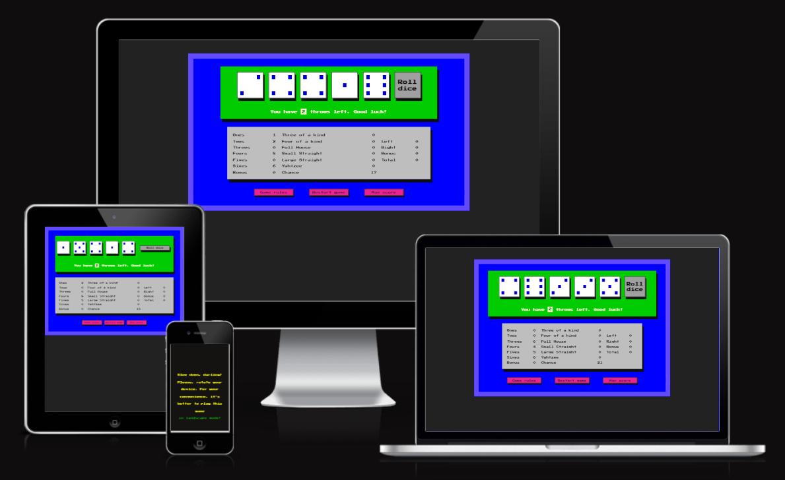

Yahtzee is a popular dice game that is played with five standard six-sided dice. The game consists of a
series of rounds, and each round involves rolling the dice up to three times in an attempt to get certain
combinations of dice faces.

This website is created for users who love mathematics and computer games. The game is based not only on luck, but also on the ability to manage available resources (current score) in order to achieve the highest possible result.

Visit the deployed website [here](https://gennadiy-gaysha.github.io/portfolio_project_2/index.html).

## Table of Contents

1. [User Experience (UX)](#user-experience-ux)
    1. [Project Goals](#project-goals)
    2. [User Stories](#user-stories)
    3. [Color Scheme](#color-scheme)
    4. [Typography](#typography)
    5. [Mockup](#mockup)
2. [Features](#features)
    1. [General](#general)
    2. [Start panel](#start-panel)
    3. [Play panel](#play-panel)
    4. [End game panel](#end-game-panel)
    5. [Game rules panel](#game-rules-panel)
    6. [Max score panel](#max-score-panel)
    7. [Locking portrait mode](#locking-portrait-mode)
    6. [404 Error page](#404-error-page)
3. [Technologies Used](#technologies-used)
    1. [Languages Used](#languages-used)
    2. [Frameworks, Libraries and Programs Used](#frameworks-libraries-and-programs-used)
4. [Testing](#testing)
    1. [Testing User Stories](#testing-user-stories)
    2. [Code Validation](#code-validation)
    3. [Accessibility](#accessibility)
    4. [Tools Testing](#tools-testing)
    5. [Manual Testing](#manual-testing)
5. [Finished Product](#finished-product)
6. [Deployment](#deployment)
7. [Cloning and Forking Repository](#cloning-and-forking-repository)
    1. [Cloning the Repository](#cloning-the-repository)
    2. [Forking the Repository](#forking-the-repository)
8. [Credits](#credits)
    1. [Content](#content)
    2. [Media](#media)
    3. [Code](#code)

***

## User Experience (UX)

### Project Goals

 - The website should offer a layout that is straightforward to comprehend and traverse.

 - The website design should incorporate complementary colors to enhance interactivity and engage the player during gameplay.

 - Responsive design should make the game accessible on different devices.

 - The website should comprise Game rules section that is easily accessible to the player.

 - It should also include a maximum score table with the history of the maximum scores gained.

 - The game should contain sound effects that create an immersive gaming atmosphere.

### User Stories

 - As a player, I want the game's website to be simple to explore and use so that I can quickly find information about the game and start playing.

 - As a player, I wish for the game to be entertaining and captivating so that I can enjoy my gaming experience and feel motivated to keep playing.

 - As a player, I would like to have effortless availability to the game rules so that I can easily reference them if needed and play the game with a clear understanding of the rules.

 - As a player, I expect the game controls to be readily accessible while playing so that I can easily control my game actions and respond quickly to changes in the game.

 - As a player, I wish to retain my gained score history so that I can track my progress and compare my scores with other players.

 - As a player, I would like to play the game on various devices so that I can have the flexibility to play the game on my preferred device.

 - As a player, I want to experience lifelike sound effects so that I can fully immerse myself in the game and enhance my overall gaming experience.

### Color Scheme

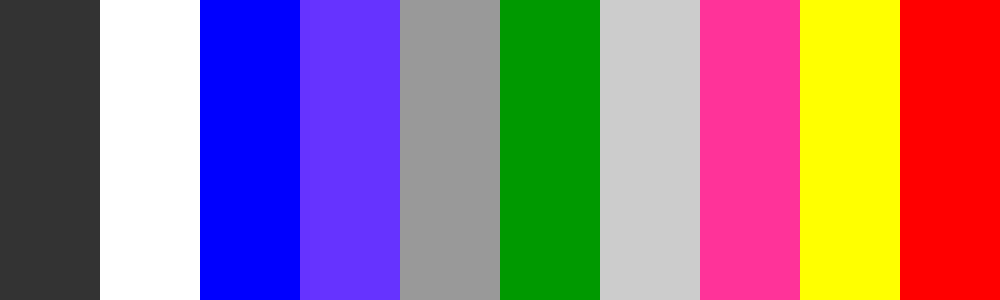

The website used a variety of colors. However, the colors that form the primary palette are as follows (from left to right):
- #ededed and #222222  - font colors
- #0000ff - main-panel backgroud color
- #624afe - border of main panel color
- #a0a0a0 - roll dice button color
- #008000 - dice area background color
- #bebebe - score and score history background color
- #eb2294 - auxiliary buttons background color
- #ffff00 - hold dice background color
- #ff0000 - dice cup color

### Typography

This site was diceded to realize in retro style of late 1980s, i. e in the style of that time when computers designed for mass Users were just beginning to appear. Therefore main font used in the site is Press Start 2P, with Sans Serif as the fallback font in case Press Start 2P is not being imported correctly. 

### Mockup

For this project it was decided to use simple and straightforward website design that wouldn't take much time to create. At the same time, I wanted to maximize the potential of JS to make the site interactive. That's why the decision was to write code for the Yahtzee game. I used the website design that it had when I first encountered the game more than 30 years ago. Below, is included two screenshots of that design that I found online. They were the basis for this site: Start panel image & Play area image.

 

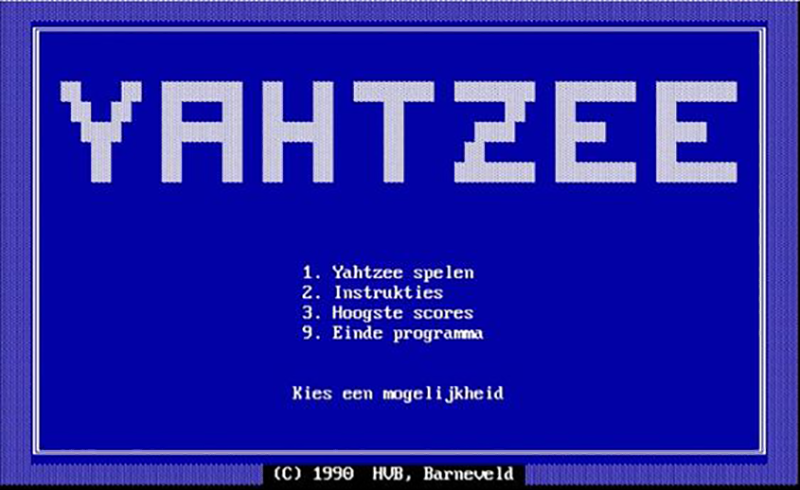

 

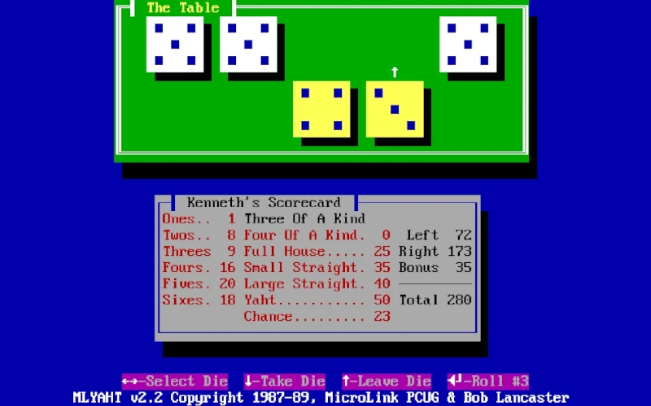

[Back To The Table of Contents ⇧](#table-of-contents)

## Features

### General

 - The website has been designed with a focus on the laptop User experience. However, the game can also be played on mobile phones in landscape mode.

 - The website has a responsive design that works seamlessly across all screen sizes and device types.

#### Start panel
- Start panel contains h1 heading - the name of the game (i.e. YAHTZEE) and "Start game" button.

- "Start game" button is div with eventListener (event - 'click') attached to it. Clicking this button switches the game to Play panel.
 

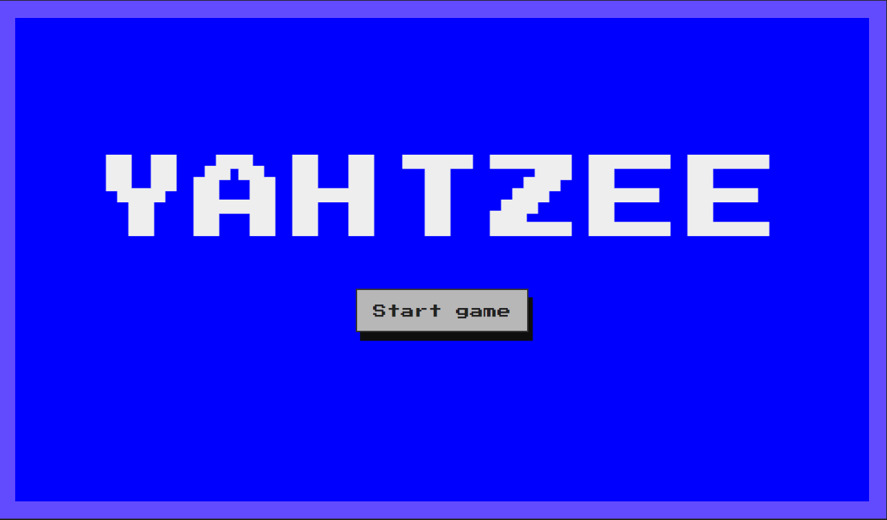
 

#### Play panel

- Playing area. 

    - Includes 6 divs that represent 5 dices and "Roll dice" button. Css pseudoclass :active applies styles to these elements and imitate clicking effect. Below this row there is interactive information line which tells the player the number of throws left.
    - In case, if after a series of three throws, the User presses "Roll dice" button for the fourth time before recording the score, a warning message appears that the round is over, and the score needs to be recorded.
     

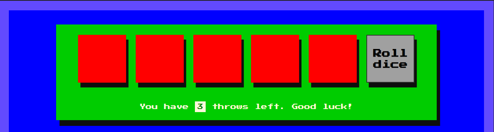
 

 

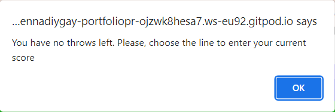
 

- Score area.

    - Allows the User to choose the line to write down the current score. Here also are presented total score and bonus point. Used fields are marked in red font.
     

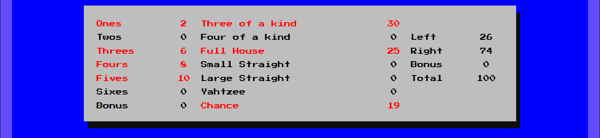
 

- Auxiliary buttons area.

    - A row of three functional buttons, namly:
        - "Game rules" button with eventListener (event - 'click') that switches to Game rules panel;
        - "Restart game" button with eventListener (event - 'click') that allows to restart the game at any time;
        - "Max score" button - switches User to the Max score panel.
     

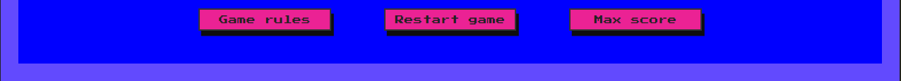
 

#### End game panel

- Shows the number of points won in the last game.
- Below the final result is located the "Play again" button that returns the User to the play panel.
     

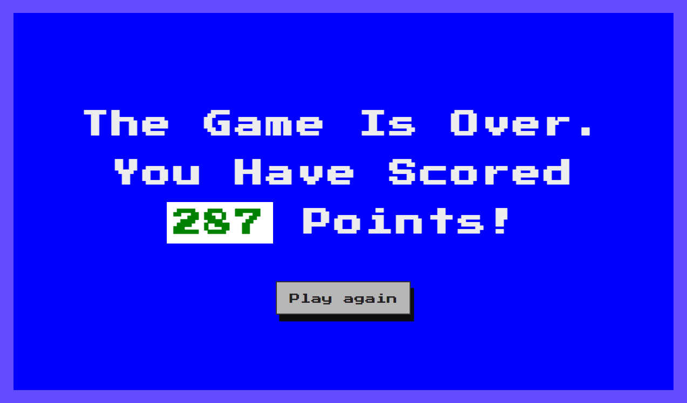
 

#### Game rules panel

- It describes the general rules of the game that were used as a basis for writing the JS code.
- To return to the game panel, there is a button "Back to play" located at the bottom of the game rules.
     

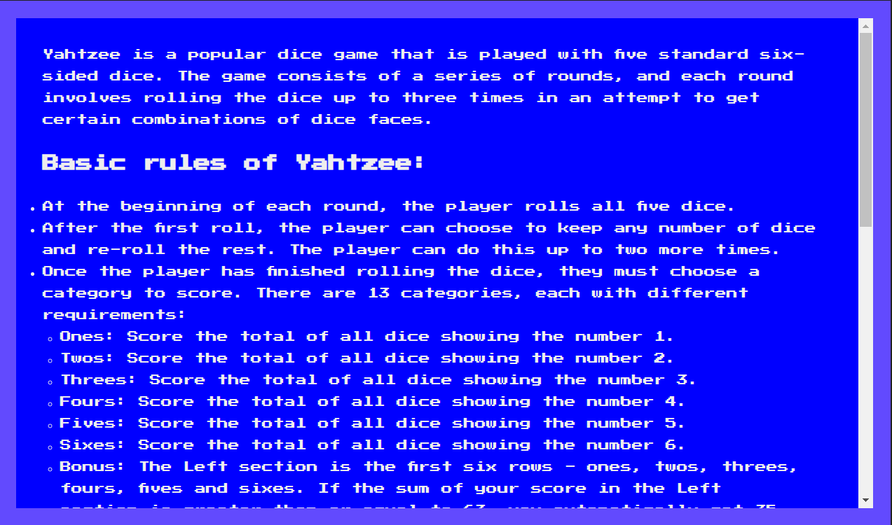

 

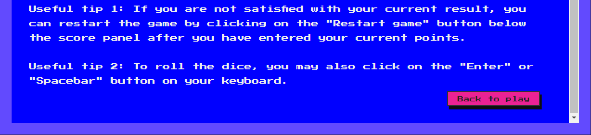
 

#### Max score panel

- Depicts 15 highes historical scores along with the date and time they were gained.
- To return to the game panel, there is a button "Back to play" located at the bottom of the panel.
     

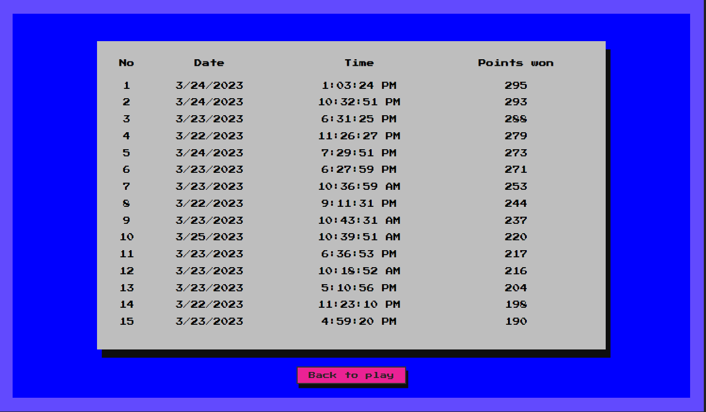

 

#### Locking portrait mode

- Since landscape screen orientation is the most convenient for Users in this game, a lock of portrait screen orientation was applied to mobile devices. For this reason a message is displayed on a screen, asking the User to rotate their mobile device.This message was intentionally written in a humorous form to create an informal atmosphere for the User.
 

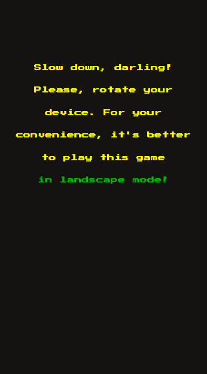

 

### 404 Error Page

- When a User clicks on a broken link or enters an invalid URL, the server responds with a 404 error page, indicating that the requested page or resource does not exist on the server. For better User experience this page was customized by including "Back to play" button that can help the User find what they are looking for.
 

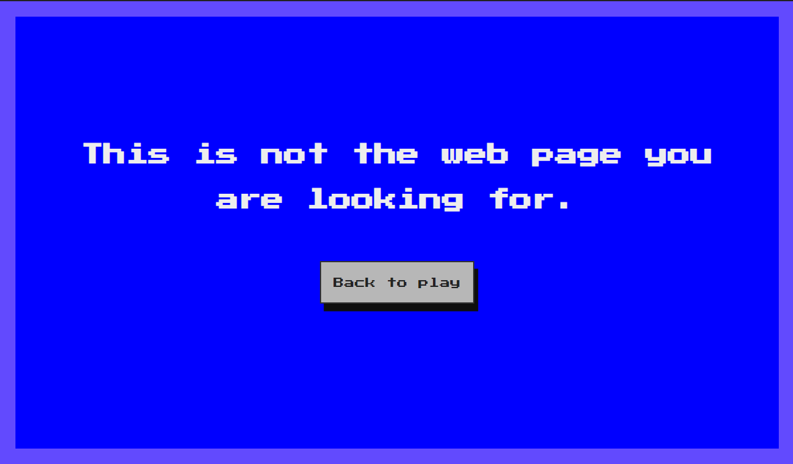

 

[Back To The Table of Contents ⇧](#table-of-contents)

## Technologies Used

### Languages Used
* [HTML5](https://en.wikipedia.org/wiki/HTML5)
* [CSS3](https://en.wikipedia.org/wiki/CSS)
* [Javascript](https://en.wikipedia.org/wiki/JavaScript)

### Frameworks, Libraries and Programs Used

* [Google Fonts](https://fonts.google.com/)
    - Google Fonts was used to import the font Press Start 2P into the style.css file. These font is used throughout the site.

* [GitPod](https://gitpod.io/)
     - GitPod was used for writing code, committing, and then pushing to GitHub.

* [GitHub](https://github.com/)
     - GitHub was used to store the project after pushing.

* [Am I Responsive?](https://ui.dev/amiresponsive?url=https://gennadiy-gaysha.github.io/portfolio_project_2/index.html)
    - Am I Responsive was used in order to see responsive design throughout the process and to generate mockup imagery to be used.

* [Chrome DevTools](https://developer.chrome.com/docs/devtools/)
    - Chrome DevTools was used during development process for code review and to test responsiveness.

* [W3C Markup Validator](https://validator.w3.org/)
    - W3C Markup Validator was used to validate the HTML code.

* [W3C CSS Validator](https://jigsaw.w3.org/css-validator/)
    - W3C CSS Validator was used to validate the CSS code.

* [JSHint](https://jshint.com/) 
    - The JSHints JavaScript Code Quality Tool was used to validate the site's JavaScript code.

[Back To The Table of Contents ⇧](#table-of-contents)

## Testing

### Testing User Stories

 - As a player, I want the game's website to be simple to explore and use so that I can quickly find information about the game and start playing.
    - All buttons have labels corresponding to their functional purpose.
    - The information bar in the [Playing area](#play-panel) informs the User about the number of remaining throws or asks the User to record the current score after using all attempts.

 - As a player, I wish for the game to be entertaining and captivating so that I can enjoy my gaming experience and feel motivated to keep playing.
    - Bright complementary colors and retro design immerse the User in the atmosphere of the 80s, when computer games were just starting to appear.
    - The simplicity of the design doesn't distract the User from unnecessary details and allows them to focus directly on the game.
    - Sound effects create a lively atmosphere.
    - The ability to save 15 results with the highest historical score allows the User to compete with themselves to get on the leaderboard.
    - The ability to roll the dices by pressing the enter or spacebar key provides additional convenience for the User.
    - If the User is not satisfied with their current score, they can restart the game at any time by clicking the "Restart game" button.
    
 - As a player, I would like to have effortless availability to the game rules so that I can easily reference them if needed and play the game with a clear understanding of the rules.
    - The rules of the game are described in the [Rules section](#game-rules-panel), which the User can access at any time by clicking the button at the bottom of the panel.

 - As a player, I expect the game controls to be readily accessible while playing so that I can easily control my game actions and respond quickly to changes in the game.
    - An imitation clicking effect has been applied to all the buttons for a more interactive User experience.
    - All main ("Roll dice", "Hold dice") and 3 auxiliary ("Game rules", "Restart game" and "Max score") buttons are presented in the [Playing area](#play-panel)
    - The User can easily return back to play from any panel by clicking on "Back to play" button.

 - As a player, I wish to retain my gained score history so that I can track my progress and compare my scores with other players.
    - The score area allows the user to enter their current score and displays the total score and bonus points. The fields for entering the score are highlighted in red font for easy identification. 
    - [Max score panel](#max-score-panel) depicts 15 highes historical scores alongs with the date and time they were gained.

 - As a player, I would like to play the game on various devices so that I can have the flexibility to play the game on my preferred device.
    - Responsive design across all device sizes was applied.

 - As a player, I want to experience lifelike sound effects so that I can fully immerse myself in the game and enhance my overall gaming experience.
    - To make this game more natural and engaging, there were 5 sound effects applied:
        - Roll-dice sound
        - Entered current score sound
        - Bonus won sound
        - Yahtzee won sound
        - End of the game sound

    ### Code Validation

- HTML 
    - Main page - no errors were returned when passing through the official [W3C validator - index.html](https://validator.w3.org/nu/?doc=https%3A%2F%2Fgennadiy-gaysha.github.io%2Fportfolio_project_2%2Findex.html)
    - Error 404 page - no errors were returned when passing through the official [W3C validator - rent.html](https://validator.w3.org/nu/?doc=https%3A%2F%2Fgennadiy-gaysha.github.io%2Fportfolio_project_2%2F404.html)
- CSS 
    - style.css - no errors were found when passing through the official [(Jigsaw) validator](https://jigsaw.w3.org/css-validator/validator?uri=https%3A%2F%2Fgennadiy-gaysha.github.io%2Fportfolio_project_2%2Findex.html&profile=css3svg&usermedium=all&warning=1&vextwarning=&lang=en)
- JS 
    - script.js - no errors were found when passing through the official [JSHints JavaScript Code Quality Tool](https://jshint.com/)
    - common.js - no errors were found when passing through the official [JSHints JavaScript Code Quality Tool](https://jshint.com/)

### Accessibility

- I confirmed that the colors and fonts chosen are easy to read and accessible by running it through Lighthouse in Devtools
    - **index.html**

    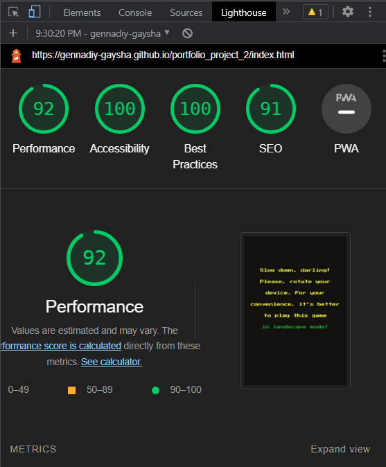

    - **404.html**

    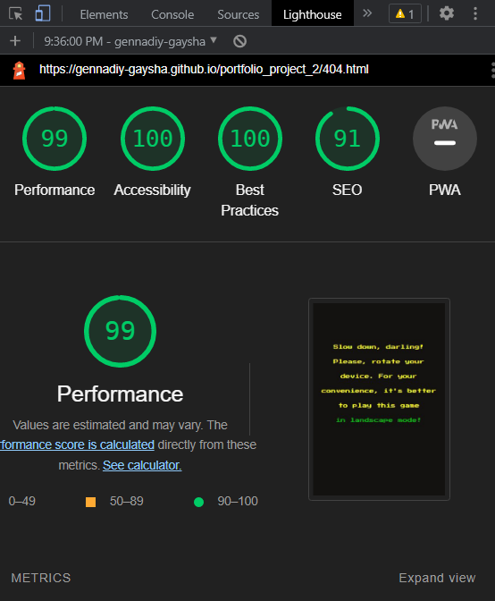

### Tools Testing

* [Chrome DevTools](https://developer.chrome.com/docs/devtools/)

    - Chrome DevTools was used during the development process to test, explore and modify HTML elements and CSS styles and lookin for errors in JS code.

### Manual Testing

* Browser Compatibility 

    - All site functions work correctly and the same in browsers that have different engines, i.e. Chrome, Firefox and Safari:

Browser | Outcome | Pass/Fail  
--- | --- | ---
Google Chrome | No problems related to the appearance, responsiveness or functionality of the website | Pass
Safari | No problems related to the appearance, responsiveness or functionality of the website | Pass
Mozilla Firefox | No problems related to the appearance, responsiveness or functionality of the website | Pass
Microsoft Edge | No problems related to the appearance, responsiveness or functionality of the website | Pass
 

* Testing Style And Functionality

| Feature | Element | Test | Outcome  | Pass/Fail |
|---|---|---|---|---|
| Start panel | "Start game" button | Style | Hovering over the button sets the cursor property to "pointer" | Pass |
|  | "Start game" button | Style | Clicking on the button mimics the effect of physically clicking the   button | Pass |
|  | "Start game" button | Functionality | Clicking the button redirects to Play Panel | Pass |
| Play panel - Playing area | An interactive information line | Functionality | An interactive infoline shows the actual number of throws left | Pass |
|  | "Roll dice" & "Hold dice" buttons | Style | Hovering over the button sets the cursor property to "pointer" | Pass |
|  | "Roll dice" & "Hold dice" buttons | Style | Clicking on the button mimics the effect of physically clicking the   button | Pass |
|  | "Roll dice" | Functionality | Clicking the button rolls the dice (generating five random numbers on   them) | Pass |
|  | "Roll dice" | Functionality | Three dice rolls are possible in one turn | Pass |
|  | "Roll dice" | Functionality | After   the third roll, an interactive information line prompts the user to write   down their current score | Pass |
|  | "Roll dice" | Functionality | After   attempting to click the button four times in a row, an alert message appears | Pass |
|  | "Roll dice" & "Hold dice" buttons | Functionality | Clicking   the 'Roll Dice' button does not roll the dice that are being held | Pass |
|  | "Hold dice" buttons (row of five dice) | Functionality | After   clicking on a dice, it becomes held and its color changes to yellow | Pass |
|  | "Hold dice" buttons (row of five dice) | Functionality | After   unclicking a dice, it becomes unheld and its color changes to white | Pass |
|  | "Roll dice" & "Hold dice" buttons | Functionality | After   the third roll, it is not possible to hold the dice, and they remain white   even after clicking on them | Pass |
| Play Panel - Score area | Score table values of current score | Style | Hovering over the values sets the cursor property to "pointer" | Pass |
|  | Score table values of current score | Style | Hovering over the values changes their background and font colors | Pass |
|  | Score table values of current score | Functionality | Before the "Roll dice" button is clicked for the   first time, they become inactive | Pass |
|  | Score table values of current score | Functionality | When   the 'Roll dice' button is clicked, the correct score values are displayed   based on the score rules | Pass |
|  | Score table values of current score | Functionality | When the "Roll dice" button is clicked, they become   active and it is possible to write down the current score | Pass |
|  | Score table current score lines | Functionality | After writing down the current score the line changes its   color to red | Pass |
|  | Score table current score lines | Functionality | After writing down the current score all the score lines become inactive | Pass |
|  | Score table current score lines | Functionality | After writing down the current score all the buttons in Playing area and   interactive infoline reset to start position | Pass |
| Play Panel | 3 pink auxiliary buttons | Style | Hovering over the button sets the cursor property to "pointer" | Pass |
|  | 3 pink auxiliary buttons | Style | Clicking on the button mimics the effect of physically clicking the   button | Pass |
|  | "Game rules" auxiliary button | Functionality | Clicking on the button redirects the User to appropriate panel hiding the   Play panel | Pass |
|  | "Restart game" auxiliary button | Functionality | Clicking   on the button, after the current score is written down, all the buttons in   the playing area and the interactive infoline reset to their starting   positions | Pass |
|  | "Max score" auxiliary button | Functionality | Clicking on the button redirects the User to appropriate panel hiding the   Play panel | Pass |
| Game Rules panel | "Back to play" button | Style | Hovering over the button sets the cursor property to "pointer" | Pass |
|  | "Back to play" button | Style | Clicking on the button mimics the effect of physically clicking the   button | Pass |
|  | "Back to play" button | Functionality | Clicking the button redirects the User to Play panel hiding the Game   Rules panel | Pass |
| Max Score panel | "Back to play" button | Style | Hovering over the button sets the cursor property to "pointer" | Pass |
|  | "Back to play" button | Style | Clicking on the button mimics the effect of physically clicking the   button | Pass |
|  | "Back to play" button | Functionality | Clicking the button redirects the User to Play panel hiding the Max Score   panel | Pass |
|  | Max Score table | Functionality | In   the table, the numbered historical scores with the date and time is   automatically recorded in descending order | Pass |
|  | Max Score table | Functionality | The   table contains 15 rows of data | Pass |
|  | Max Score table | Functionality | All the table data are saved on User computer (Local Storage   API) | Pass |
|  | Max Score table | Functionality | Table   data are stored on the user's computer in the browser's Local Storage. | Pass |
|  | Max Score table | Functionality | The table data will be available to the user even after they close the   browser or shut down their computer | Pass |
| End of the Game panel | Interactive infoline | Functionality | The   score that the player has earned is shown on the infoline | Pass |
|  | "Play again" button | Style | Hovering over the button sets the cursor property to "pointer" | Pass |
|  | "Play again" button | Style | Clicking on the button mimics the effect of physically clicking the   button | Pass |
|  | "Play again" button | Functionality | Clicking the button redirects the User to Play panel hiding the End of   the Game Panel panel | Pass |
| Site   responsiveness | All panels | > 1500 | Look   good and function on the chosen screen size using the Chrome devtools toolbar | Pass |
|  |  | <= 1500 | Look good and function on the chosen screen size using the   Chrome devtools toolbar | Pass |
|  |  | <= 1350 | Look good and function on the chosen screen size using the   Chrome devtools toolbar | Pass |
|  |  | <= 1200 | Look good and function on the chosen screen size using the   Chrome devtools toolbar | Pass |
|  |  | <= 1100 | Look good and function on the chosen screen size using the   Chrome devtools toolbar | Pass |
|  |  | <= 920 | Look good and function on the chosen screen size using the   Chrome devtools toolbar | Pass |
|  |  | <= 850 | Look good and function on the chosen screen size using the   Chrome devtools toolbar | Pass |
|  |  | <= 768 | Look good and function on the chosen screen size using the   Chrome devtools toolbar | Pass |
|  |  | <= 567 | A   panel with an informational message appears, suggesting that the user rotate   their mobile device to landscape mode | Pass |
| 404 Error page | Page itself | Functionality | Appears when a user attempts to access a page that does not exist on the website | Pass |
|  | "Back to play" button | Style | Hovering over the button sets the cursor property to "pointer" | Pass |
|  | "Back to play" button | Style | Clicking on the button mimics the effect of physically clicking the   button | Pass |
|  | "Back to play" button | Functionality | Clicking the button redirects the User to Play panel hiding the 404 Error   page | Pass |
| Sound effects | Roll-dice sound  | Functionality | Occurs when the User clicks on "Roll dice" button | Pass |
|  | Entered current score sound | Functionality | Occurs when the User enters their current score | Pass |
|  | Yahtzee won sound | Functionality | Occurs when Yahtzee is rolled | Pass |
|  | Bonus won sound | Functionality |Occurs when User earns a bonus | Pass |
|  | End of the game sound | Functionality |Occurs when the round ends | Pass |

[Back To The Table of Contents ⇧](#table-of-contents)

## Finished Product

Page / Section | Image
--- | ---
Desktop Version | 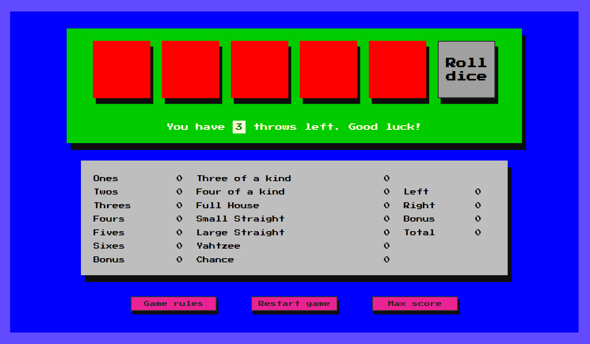
Mobile version (for screen whidth <= 768px)| 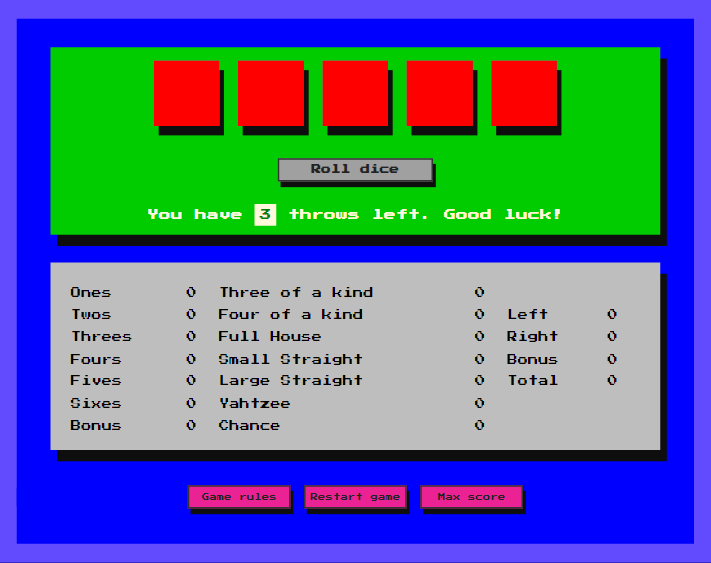
Start panel | 
Game rules panel | 
Max score panel | 
End game panel | 
Lock of portrait mode | 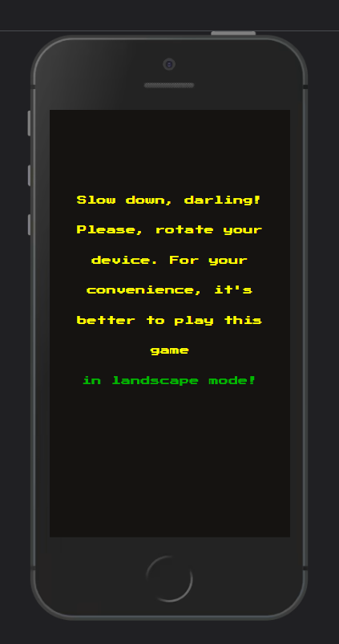
404 Error Page | 

 

[Back To The Table of Contents ⇧](#table-of-contents)

## Deployment

- This website was developed using [GitPod](https://www.gitpod.io/), which was then committed and pushed to GitHub using the GitPod terminal.

- The site was deployed to GitHub pages. The steps to deploy are as follows: 
    1. Log in to GitHub and locate the [GitHub Repository](https://github.com/).
    2. At the top of the Repository, locate the Settings button on the menu.
    3. On the left of the Settings page choose the Pages section.
    4. Under Source, click the dropdown called None and select Main Branch.
    5. The page will refresh automatically and generate a link to your website.

You can visit the deployed website  [here](https://gennadiy-gaysha.github.io/portfolio_project_2/index.html)

## Cloning and Forking Repository
To make changes to the code without affecting the original version stored in the repository you may create a local copy of the repository, through cloning and forking methods.

### Cloning the Repository

- Install Git on your local machine, if it is not already installed.
- Navigate to the repository you want to clone in a web browser.
- Click the "Clone or download" button and copy the repository's URL (`https://github.com/gennadiy-gaysha/portfolio_project_2.git`)to your clipboard.
- Open a terminal or command prompt on your local machine.
- Change to the directory where you want to clone the repository.
- Type the command `git clone https://github.com/gennadiy-gaysha/portfolio_project_2.git` and press enter.
- Wait for the repository to download to your local machine.
- Once the repository is downloaded, you can make changes to the code and use Git to manage and sync those changes with the original repository.

### Forking the Repository

- Navigate to the repository you want to fork in a web browser.
- Click the "Fork" button in the top right corner of the page.
- Select your account as the destination for the forked repository.
- Wait for the repository to be forked to your account.
- Once the repository is forked, you can clone it to your local machine using the steps above for cloning a repository.
- You can make changes to the code and commit those changes to your forked repository. If you want to contribute those changes back to the original repository, you can create a pull request from your forked repository to the original repository.

These instructions should help you create a local copy of a code repository using both cloning and forking methods, allowing you to make changes to the code and collaborate with other developers on the project.

## Credits

- I'm acknowleged to my student friends who introduced me to the computer game Yahtzee back in the 80s. I tried to reproduce the design of that exact game as accurately as possible on my website.
- Since the JS code for creating an [interactive table](#max-score-panel) with historical results (Max score panel) was written with the help of prompts from the [GPT Chat](https://chat.openai.com/chat), it cannot be considered written by me personally.

### Content

- Markdown for the testing table in readme.md file was created using [Tables Generator](https://www.tablesgenerator.com/markdown_tables) 
- Grammar and spelling were checked using the power of [GPT Chat](https://chat.openai.com/chat) and [Grammarly](https://www.grammarly.com/) web app. 

### Media

- All sound effects were taken from open source site [https://pixabay.com/](https://pixabay.com/sound-effects/search/dice/).
- The images used as [Mockups](#mockup) were taken from open source sites.

### Code

- I've been constantly using [Stack Overflow](https://stackoverflow.com/), 
[W3Schools](https://www.w3schools.com/) and Chrome Dev tools for inspiration 
and better understanding the code being implemented.

[Back To The Table of Contents ⇧](#table-of-contents)