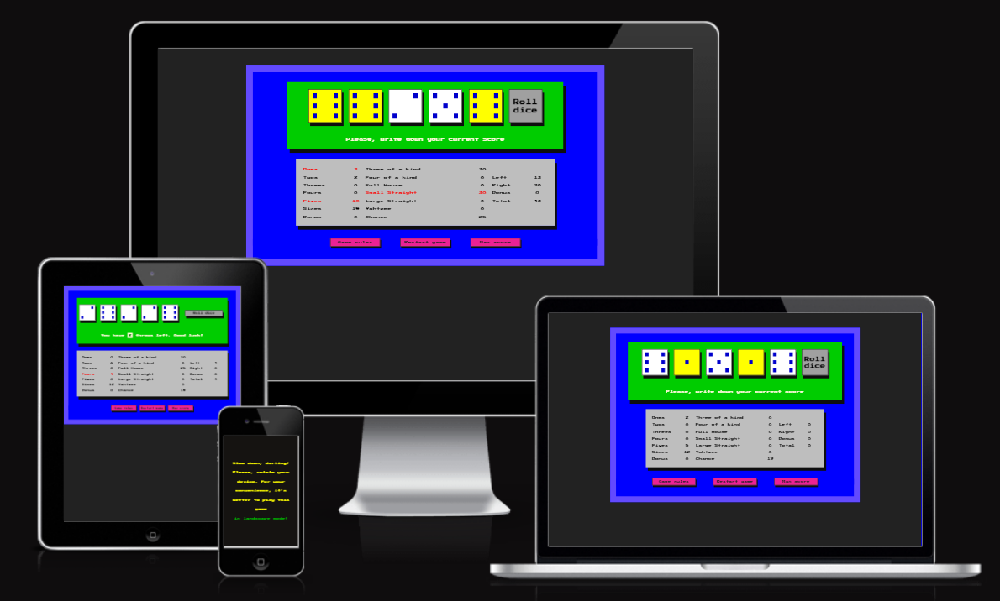

# Yahtzee

Yahtzee is a popular dice game that is played with five standard six-sided dice. The game consists of a
series of rounds, and each round involves rolling the dice up to three times in an attempt to get certain
combinations of dice faces.

## Basic rules of Yahtzee:

- At the beginning of each round, the player rolls all five dice.
- After the first roll, the player can choose to keep any number of dice and re-roll the rest. The player can do this up to two more times.
- Once the player has finished rolling the dice, they must choose a category to score. There are 13 categories, each with different requirements:
    - Ones: Score the total of all dice showing the number 1.
    - Twos: Score the total of all dice showing the number 2.
    - Threes: Score the total of all dice showing the number 3.
    - Fours: Score the total of all dice showing the number 4.
    - Fives: Score the total of all dice showing the number 5.
    - Sixes: Score the total of all dice showing the number 6.
    - Bonus: The Left section is the first six rows - ones, twos, threes, fours, fives and sixes. If the sum of your score in the Left
section is greater than or equal to 63, you automatically get 35 bonus points.
    - Three of a kind: Score the total of all dice if there are at least three of the same number.
    - Four of a kind: Score the total of all dice if there are at least four of the same number.
    - Full house: Score 25 points if there are three of one number and two of another.
    - Small straight: Score 30 points if there are four sequential numbers.
    - Large straight: Score 40 points if there are five sequential numbers.
    - Yahtzee: Score 50 points if all five dice show the same number.
    - Chance: Score the total of all dice, regardless of the numbers.

Once the player has chosen a category to score, they cannot choose that category again for the rest of the game.
The game continues for 13 rounds, after which the player with the highest total score wins.

These are the basic rules of Yahtzee, but there are many variations and additional rules that can be added to make the game more interesting or challenging.

Visit the deployed website [here](https://gennadiy-gaysha.github.io/portfolio_project_2/).

## Table of Contents

1. [User Experience (UX)](#user-experience-UX)
    1. [Project Goals](#project-goals)
    2. [User Stories](#user-stories)
    3. [Color Scheme](#color-scheme)
    4. [Typography](#typography)
    5. [Wireframes](#wireframes)
2. [Features](#features)
    1. [General](#general)
    2. [Home Section](#home-section)
    3. [Instructions Section](#instructions-section)
    4. [Game section](#game-section)
    5. [Result Section](#result-section)
    6. [404 Error Page](#404-error-page)
3. [Technologies Used](#technologies-used)
    1. [Languages Used](#languages-used)
    2. [Frameworks, Libraries and Programs Used](#frameworks-libraries-and-programs-used)
4. [Testing](#testing)
    1. [Testing User Stories](#testing-user-stories)
    2. [Code Validation](#code-validation)
    3. [Accessibility](#accessibility)
    4. [Tools Testing](#tools-testing)
    5. [Manual Testing](#manual-testing)
5. [Finished Product](#finished-product)
6. [Deployment](#deployment)
    1. [GitHub Pages](#github-pages)
7. [Credits](#credits)
    1. [Content](#content)
    2. [Media](#media)
    3. [Code](#code)
8. [Acknowledgements](#acknowledgements)

***

## User Experience (UX)

### Project Goals

* The website should offer a layout that is straightforward to comprehend and traverse.

* The website should contain complementary colors that interactivity to engage the player in the game play.

* Responsive design should make the game accessible on different devices.

* The website should comprise rule section that is easily accessible to the player..

* It should also include a maximum score table with the history of the maximum scores gained.

* The game should contain sound effects that create an immersive gaming atmosphere.

### User Stories

* As a player, I want that the game's website is simple to explore and use.

* As a player, I wish for the game to be entertaining and captivating.

* As a player, I would like to have effortless availability to the game rules.

* As a player, I expect the game controls to be readily accessible while playing.

* As a player, I wish the ability to retain my gained score history.

* As a player, I would like to play the game on various devices.

* As a player, I want to experience lifelike sound effects.

### Color Scheme

The website used a variety of colors. However, the colors that form the primary palette are as follows (from left to right):
- #ededed and #222222  - font colors
- #0000ff - main-panel backgroud color
- #624afe - border of main panel color
- #a0a0a0 - roll dice button color
- #008000 - dice area background color
- #bebebe - score and score history background color
- #eb2294 - auxiliary buttons background color
- #ffff00 - hold dice background color
- #ff0000 - dice cup color

### Typography

This site was diceded to realize in retro style of 1980s, i. e in the style of that time when computers designed for mass users were just beginning to appear. Therefore main font used in the site is Press Start 2P, with Sans Serif as the fallback font in case Press Start 2P is not being imported correctly. 

### Mockup

For this project it was decided to use simple and straightforward website design that wouldn't take much time to create. At the same time, I wanted to maximize the potential of JS to make the site interactive. That's why the decision was to write code for the Yahtzee game. I used the website design that it had when I first encountered the game more than 30 years ago. Below, is included two screenshots of that design that I found online. They were the basis for this site: Start panel image & Play area image.

 

 

## Features

### General

 - The website has been designed with a focus on the laptop user experience.

 - The website has a responsive design that works seamlessly across all screen sizes and device types.

#### Start panel
- Start panel contains h1 heading - the name of the game (i.e. YAHTZEE) and "Start game" button.

- "Start game" button is div with eventListener (event - 'click') attached to it. Clicking this button switches the game to Play panel.
 

 

#### Play panel - comprises 3 consecutive areas.

- Playing area. 

    - Includes 6 divs that represent 5 dices and "Roll dice" button. Css pseudoclass :active applies styles to these elements and immitate clicing effect. Below this row there is interactive information line which tells the player the number of throws left.
     

 

- Score area.

    - Allows the user to choose the line to write down the current score. Here also are presented total score and bonus point. Used fields are marked in red font.
     

 

- Auxiliary buttons area.

    - A row of three functional buttons, namly:
        - "Game rules" button with eventListener (event - 'click') that switches to Game rules panel;
        - "Restart game" button with eventListener (event - 'click') that allows to restart the game at any time;
        - "Max score" button - switches user to the Max score panel.
     

 

#### End game panel

- Shows the number of points won in the last game.
- Below the final result is located the "Play again" button that returns the user to the play panel.
     

 

#### Game rules panel

- It describes the general rules of the game that were used as a basis for writing the JS code.
- To return to the game panel, there is a button "Back to play" located at the bottom of the game rules.
     

 

 

#### Max score panel

- Depicts 15 highes historical scores alongs with the date and time they were gained.
- To return to the game panel, there is a button "Back to play" located at the bottom of the panel.
     

 

#### Locking of portrait screen orientation.

- Since landscape screen orientation is the most convenient for users in this game, a lock of portrait screen orientation was applied to mobile devices. For this reason a message is displayed on a screen, asking the user to rotate their mobile device.
 

 

### 404 Error Page

- A 404 error page is an HTTP status code indicating that the server could not find the requested resource. When a user clicks on a broken link or enters an invalid URL, the server responds with a 404 error page, indicating that the requested page or resource does not exist on the server. For better user experience thie page was customized by including "Back to play" button that can help the user find what they are looking for.
 

 

## Technologies Used

### Languages Used
* [HTML5](https://en.wikipedia.org/wiki/HTML5)
* [CSS3](https://en.wikipedia.org/wiki/CSS)
* [Javascript](https://en.wikipedia.org/wiki/JavaScript)

### Frameworks, Libraries and Programs Used

* [Google Fonts](https://fonts.google.com/)
    - Google Fonts was used to import the fonts Nunito and Odibee Sans into the style.css file. These fonts were used throughout the site.

* [Font Awesome](https://fontawesome.com/)
     - Font Awesome was used throughout all pages to add icons in order to create a better visual experience for UX purposes.

* [GitPod](https://gitpod.io/)
     - GitPod was used for writing code, committing, and then pushing to GitHub.

* [GitHub](https://github.com/)
     - GitHub was used to store the project after pushing.

* [Balsamiq](https://balsamiq.com/)
     - Balsamiq was used to create the wireframes during the design phase of the project.

* [Am I Responsive?](http://ami.responsivedesign.is/#)
    - Am I Responsive was used in order to see responsive design throughout the process and to generate mockup imagery to be used.

* [Responsive Design Checker](https://www.responsivedesignchecker.com/)
    - Responsive Design Checker was used in the testing process to check responsiveness on various devices.

* [Chrome DevTools](https://developer.chrome.com/docs/devtools/)
    - Chrome DevTools was used during development process for code review and to test responsiveness.

* [W3C Markup Validator](https://validator.w3.org/)
    - W3C Markup Validator was used to validate the HTML code.

* [W3C CSS Validator](https://jigsaw.w3.org/css-validator/)
    - W3C CSS Validator was used to validate the CSS code.

* [JSHint](https://jshint.com/) 
    - The JSHints JavaScript Code Quality Tool was used to validate the site's JavaScript code.

* [Favicon.cc](https://www.favicon.cc/) 
    - Favicon.cc was used to create the site favicon.

[Back to top ⇧](#rpsls)

## Testing

### Testing User Stories

* As a player, I want the game's website to be easy to navigate.

    - A carousel design has been implemented to move across the different sections with ease.

    - The website offers an intuitive structure for the player to find easily the information or section they are looking for.

    - The navigation bar is clearly presented to assist with the site's navigation.

* As a player, I want the game to be fun and engaging.

    - A fun main image has been selected to represent the game in a fun way.

    - The site's color design has been inspired on the main image in order to create a clear relation between each color used and the weapons available in the game.
    
    - The game area display the weapons chosen by both the player and the computer in their respective colors and icons.

    - The score for the current round is being tracked and displayed on the top of the game section.

    - Feedback area display the result for each round with a short explanation.

    - The game result is provided in a fun way with adaptable colors and GIFs depending on the result.

* As a player, I want to have easy access to the game rules.

    - A rules bottom is being provided directly on the game section.

    - The rules open on a popup directly on the game section so the player does not need to leave the game.

* As a player, I want the game controls to be easy to access during the game.

    - All the game buttons are being provided on the bottom of the game section for easy access.

* As a player, I want to receive overall feedback during and after the game.

    - Score for the current round is always available on the top of the game section.

    - The result for each round is being provided with a short explanation.

    - A clear game result gets displayed after the game.

* As a player, I want to be able to play the game on different devices.

    - Responsive design across all device sizes.

    ### Code Validation

* The [W3C Markup Validator](https://validator.w3.org/) and [W3C CSS Validator](https://jigsaw.w3.org/css-validator/) services were used to validate all pages of the project in order to ensure there were no syntax errors.

    - W3C Markup Validator returned a series of warnings concerning a possible misuse of aria-label. I considered this aria labels are being used to make available the icons in the rules popup available for the visually impaired.

    -  W3C CSS Validator found no errors or warnings on my CSS.

* The [JSHints JavaScript Code Quality Tool](https://jshint.com/) was used validate the site's JavaScript code.

    - JSHints found no errors on the site's JavaScript code.

### Accessibility

* Used Lighthouse in Chrome DevTools to confirm that the colors and fonts being used in throughout the website are easy to read and accessible.

* Lighthouse reports

    - **index.html**

    

    - **404.html**

    

### Tools Testing

* [Chrome DevTools](https://developer.chrome.com/docs/devtools/)

    - Chrome DevTools was used during the development process to test, explore and modify HTML elements and CSS styles used in the project.

* Responsiveness

    - [Am I Responsive?](http://ami.responsivedesign.is/#) was used to check responsiveness of the site pages across different devices.

    - [Responsive Design Checker](https://www.responsivedesignchecker.com/) was used to check responsiveness of the site pages on different screen sizes.

    - Chrome DevTools was used to test responsiveness in different screen sizes during the development process.

### Manual Testing

* Browser Compatibility

Browser | Outcome | Pass/Fail  
--- | --- | ---
Google Chrome | No appearance, responsiveness nor functionality issues.| Pass
Safari | No appearance, responsiveness nor functionality issues. | Pass
Mozilla Firefox | Scrollbar is visible even though it should be hidden.  No responsiveness nor functionality issues.| Pass
Microsoft Edge | No appearance, responsiveness nor functionality issues. | Pass

**Comments:** Even thought the scrollbar is visible in Mozilla Firefox, the developer decided not to address this issue as the apappearance is not importantly affected.

* Device compatibility

Device | Outcome | Pass/Fail
--- | --- | ---
MacBook Pro 15" | No appearance, responsiveness nor functionality issues. | Pass
Dell Latitude 5300 | No appearance, responsiveness nor functionality issues. | Pass
iPad Pro 12.9" | No appearance, responsiveness nor functionality issues. | Pass
iPad Pro 10.5" | No appearance, responsiveness nor functionality issues. | Pass
iPhone XR | No appearance, responsiveness nor functionality issues. | Pass
iPhone 7 | No appearance, responsiveness nor functionality issues. | Pass

**Comments:** The landscape block mode gets activated on old devices due to their small screen size (eg. iPhone 4/3). The developer decided not to address this issue due to time constrains and the age of the devices being affected.

* Common Elements Testing

    - General

    Feature | Outcome | Pass/Fail
    --- | --- | ---
    Navigation Bar | Hover effect and links are working as expected. | Pass
    Carousel | Scroll and snapping functionality are working as expected | Pass
    Social Links | Open the specific website on a new tab. | Pass
    Wide screen background | Show video background on devices with screen 1024px and up. | Pass
    Landscape Orientation Blocker | Show full screen section when device is turned to landscape orientation. | Pass

    - Home Section
    
    Feature | Outcome | Pass/Fail
    --- | --- | ---
    Start Game Button | Hover effect work and link to game section when button is clicked work as expected. | Pass
    Feedback Button | Hover effect work as expected and open feedback form popup when clicked. | Pass
    
    - Feedback Form Popup
    
    Feature | Outcome | Pass/Fail
    --- | --- | ---
    Form | Require all fields in the right format before submission. |  Pass
    Send Feedback Button | Hover effect work as expected and submit form when cicked. |  Pass
    Close Button | Hover effect work as expected and close popup when clicked. | Pass

    - Game Section

    Feature | Outcome | Pass/Fail
    --- | --- | ---
    Player Score | Increase by 1 when player win round. |  Pass
    Computer Score | Increase by 1 when computer win round. |  Pass
    Player Icon | Display the weapon chosen by the player. | Pass
    Computer Icon | Display the weapon generated by the computer. | Pass
    Game Feedback | Display the expected text depending on the round result. | Pass
    Game Buttons | Clicking on each button select the correct weapon. | Pass
    Rules Button | Hover effect work as expected and open rules popup when clicked. | Pass
    Rules' Close Button | Hover effect work as expected and close popup when clicked. | Pass

    - Result Section

    Feature | Outcome | Pass/Fail
    --- | --- | ---
    Result Title | Display the expected text depending on the game result. | Pass
    GIF Image | Display expected GF image depending on the game result. | Pass
    Play Again Button | Hover effect work as expected and hide section when clicked. | Pass
    Main Menu Button | Hover effect work and link to home section when button is clicked work as expected. | Pass
    Section Background | | Display the expected color depending on the game result. | Pass

    - 404 Error Page

    Feature | Outcome | Pass/Fail
    --- | --- | ---
    404 Error Page | Entering an incorrect address into the address bar bring the player to the 404 error page. | Pass
    Back to the Game Button | Hover effect work and link to home section when button is clicked work as expected. | Pass

[Back to top ⇧](#rpsls)

## Finished Product

Page / Section | Image
--- | ---
Desktop Version | 
Home Section | 
Feedback Popup | 
Instructions Section | 
Game Section | 
Rules Popup | 
Result Sections | 
Landscape Orientation Blocker | 
404 Error Page | 

[Back to top ⇧](#rpsls)

## Deployment

* This website was developed using [GitPod](https://www.gitpod.io/), which was then committed and pushed to GitHub using the GitPod terminal.

### GitHub Pages

* Here are the steps to deploy this website to GitHub Pages from its GitHub repository:

    1. Log in to GitHub and locate the [GitHub Repository](https://github.com/).

    2. At the top of the Repository, locate the Settings button on the menu.

        - Alternatively click [here](https://raw.githubusercontent.com/) for a GIF demostration of the process.

    3. Scroll down the Settings page until you locate the Pages section.

    4. Under Source, click the dropdown called None and select Master Branch.

    5. The page will refresh automatically and generate a link to your website.

[Back to top ⇧](#rpsls)

## Credits

### Content

* The instructions and rules were taken from the [Big Bang Theory Wiki](https://bigbangtheory.fandom.com/wiki/Rock,_Paper,_Scissors,_Lizard,_Spock).

### Media

* The main image was taken from [TeePublic](https://www.teepublic.com/t-shirt/17021-rock-paper-scissors) and was designed by [Samiel](https://www.teepublic.com/user/samiel).

* The GIF used in the 404 error page was taken from [GIPHY](https://giphy.com/gifs/paper-bag-breathing-aa9VQ6gg5wCBy).

* The background video was taken from [Pexels](https://www.pexels.com/video/arrow-shape-design-on-green-background-4665103/?utm_content=attributionCopyText&utm_medium=referral&utm_source=pexels) and was created by [Miguel Á. Padriñán](https://www.pexels.com/@padrinan?utm_content=attributionCopyText&utm_medium=referral&utm_source=pexels). 

### Code

* [Stack Overflow](https://stackoverflow.com/), [CSS-Tricks](https://css-tricks.com/) and [W3Schools](https://www.w3schools.com/) were consulted on a regular basis for inspiration and sometimes to be able to better understand the code being implement.

* The code for the carousel is a modified version of the CSS-Tricks code found [here](https://css-tricks.com/css-only-carousel/ ).

* The code for the popups is a modified version of the W3Schools code found [here](https://www.w3schools.com/howto/howto_js_popup_form.asp).

* The code to apply the full screen background was found at [CSS-Tricks](https://css-tricks.com/full-page-background-video-styles/).

[Back to top ⇧](#rpsls)

## Acknowledgements

* My partner, for her unconditional love, help and continued support in all aspects of life to make possible for me to complete this project.

* My family, for their valuable opinions, critics and support during the design and development process.

* My tutor, Marcel, for his invaluable feedback and guidance.

* My friend, Miguel, for all the late calls, support and ideas that made me challenge myself.

* Code Institute and its amazing Slack community for their support and providing me with the necessary knowledge to complete this project.

[Back to top ⇧](#rpsls)